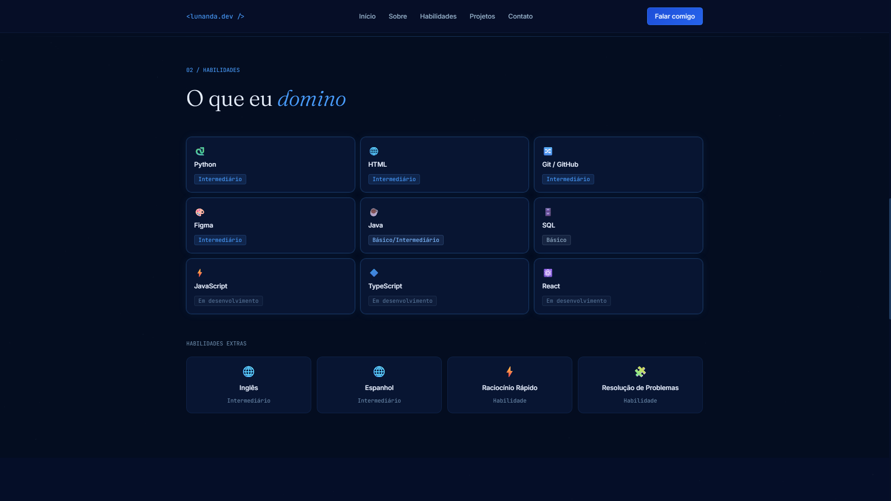
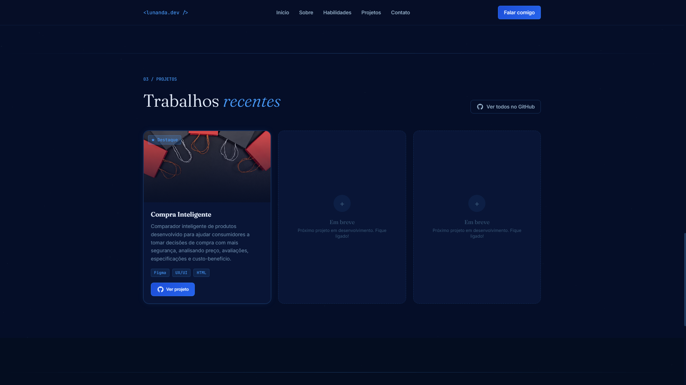
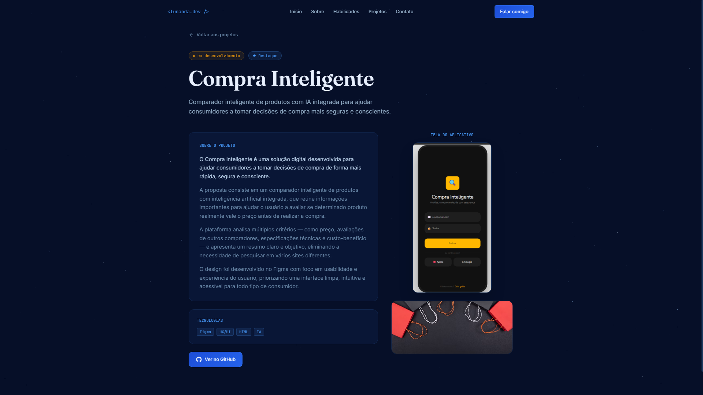

# Portfólio Pessoal

## 1. Apresentação

Este projeto é a prototipação do meu portfólio pessoal, desenvolvido no Figma para apresentar um pouco sobre mim, minhas habilidades e os projetos que venho desenvolvendo durante minha formação na área de tecnologia.

A ideia do portfólio é reunir essas informações em um só lugar, de uma forma simples e organizada, para facilitar a apresentação dos meus conhecimentos e projetos.

## 2. Stacks / Habilidades

As principais tecnologias e habilidades que estou desenvolvendo são:

* Python
* HTML
* Java
* SQL
* Git e GitHub
* Raciocínio lógico
* Resolução de problemas

Também possuo conhecimentos de inglês e espanhol em nível intermediário.

## 3. Projetos

### Compra Inteligente

O Compra Inteligente é um projeto pensado para ajudar pessoas a tomarem decisões melhores antes de comprar um produto.

A proposta é utilizar inteligência artificial para comparar preços, avaliações, especificações e custo-benefício, mostrando ao usuário se determinado produto vale a pena, se é melhor esperar ou se existem opções melhores.

O projeto foi desenvolvido durante as atividades da disciplina de Design de Experiência, utilizando o Figma para criação das telas e prototipação.

## 4. Página individual do projeto

O portfólio possui uma página individual para apresentar informações mais detalhadas sobre o projeto **Compra Inteligente**.

Nessa página são apresentadas informações sobre o projeto, seu objetivo e a solução proposta.

### Links

* [Visualizar o portfólio](https://both-sepia-52448935.figma.site)
* [Acessar o projeto no Figma](https://www.figma.com/make/ngjqnWxISTa8srLH2QqV5l/Portfolio-website-design?p=f&t=9bM01C8n03S4jeir-0)

## Prints das telas

### Apresentação

### Stacks / Habilidades

### Projetos

### Página individual do projeto

